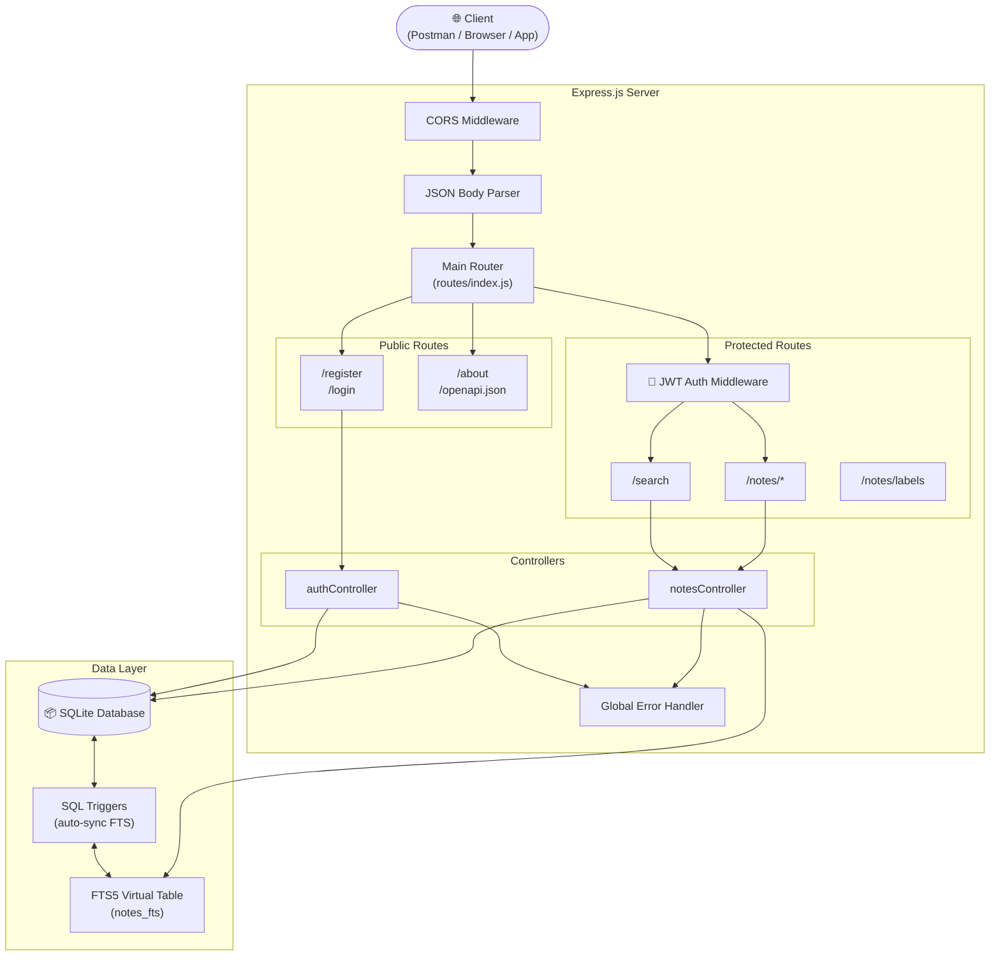
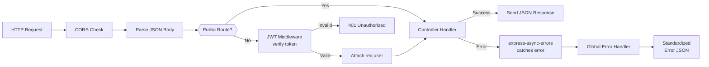
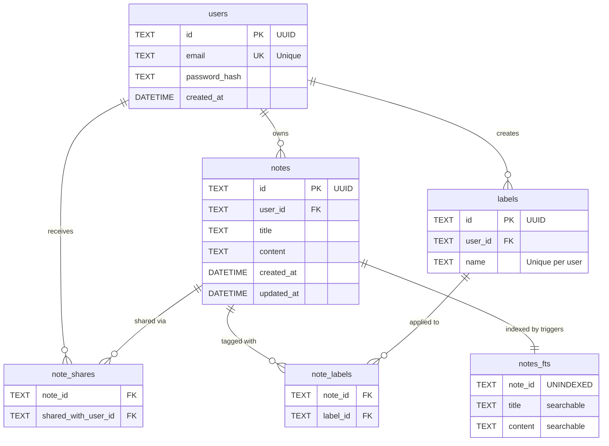
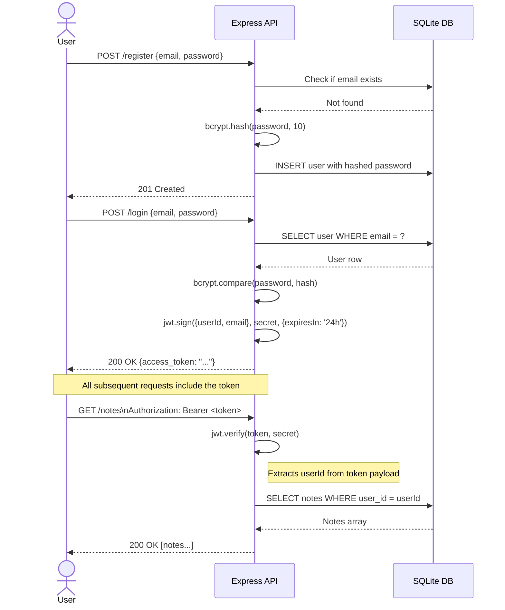
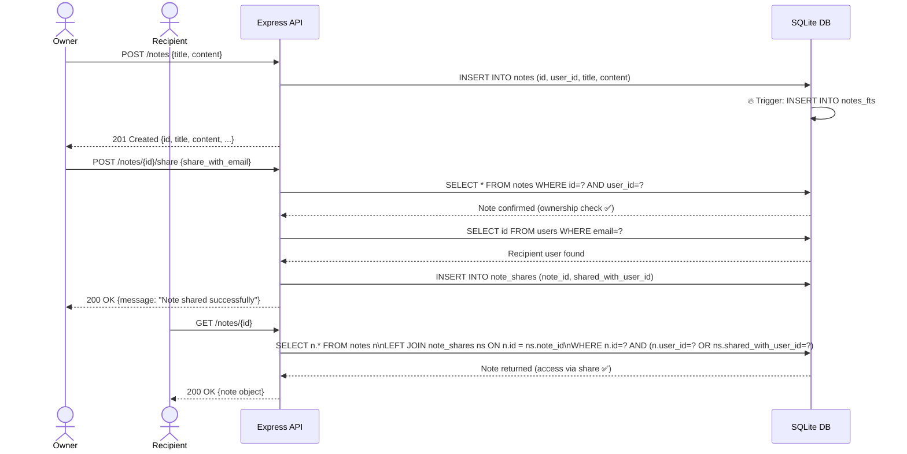
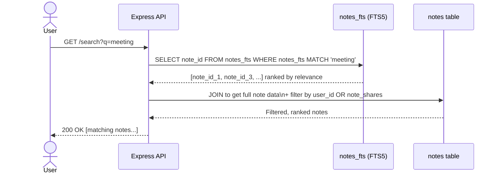

# 📝 Notes API — Backend Service

> A production-ready, multi-user notes backend inspired by **Google Keep** and **Apple Notes**. Built with Express.js and SQLite with FTS5 full-text search.

[](https://nodejs.org)
[](https://expressjs.com)
[](https://sqlite.org)
[](https://jwt.io)

---

## 📋 Table of Contents

- [Features](#-features)
- [Tech Stack](#-tech-stack)
- [Quick Start](#-quick-start)
- [Project Architecture](#-project-architecture)
- [Database Schema & ER Diagram](#-database-schema--er-diagram)
- [API Reference](#-api-reference)
- [Authentication Flow](#-authentication-flow)
- [Note Lifecycle & Sequence Diagrams](#-note-lifecycle--sequence-diagrams)
- [Security Design](#-security-design)
- [Environment Variables](#-environment-variables)
- [Testing the API](#-testing-the-api)

---

## ✨ Features

| Feature | Description |
|---|---|
| **User Registration & Login** | Secure auth with bcrypt password hashing and 24h JWT tokens |
| **Notes CRUD** | Full create, read, update, delete on personal notes |
| **Note Sharing** | Share any note with another registered user via their email |
| **Labels / Tags** ⭐ | Custom feature — tag notes with labels and filter by them |
| **Full-text Search** | SQLite FTS5 powered search across note titles and content |
| **Pagination** | `limit` & `offset` support on `GET /notes` |
| **OpenAPI Docs** | Machine-readable Swagger 3.0 spec at `/openapi.json` |
| **Authorization Guards** | Users can only access their own notes or notes explicitly shared with them |

---

## 🛠 Tech Stack

| Layer | Technology | Why |
|---|---|---|
| **Runtime** | Node.js 18+ | Non-blocking I/O, ideal for API-heavy workloads |
| **Framework** | Express.js 4 | Minimal, fast, battle-tested HTTP framework |
| **Database** | SQLite + FTS5 | Zero-config, embedded DB; FTS5 enables fast full-text search |
| **Auth** | JWT (jsonwebtoken) | Stateless, scalable token auth — no server-side session storage needed |
| **Password Hashing** | bcryptjs | Industry-standard adaptive hashing (cost factor 10) |
| **ID Generation** | uuid v4 | Cryptographically random, collision-resistant IDs |
| **Error Handling** | express-async-errors | Eliminates try/catch boilerplate in async route handlers |
| **Dev Server** | nodemon | Auto-restart on file changes |

---

## 🚀 Quick Start

### Prerequisites
- Node.js 18 or higher
- npm 9+

### 1. Clone the repository
```bash
git clone https://github.com/prakharsingh-74/People-team-Assignment.git
cd People-team-Assignment
```

### 2. Install dependencies
```bash
npm install
```

### 3. Configure environment
Create a `.env` file in the project root (or copy from the template):
```env
PORT=3000
JWT_SECRET=replace_this_with_a_long_random_secret
NODE_ENV=development
```


### 4. Start the server

```bash
# Production mode
npm start

# Development mode (auto-restart on changes)
npm run dev
```

### 5. Verify the server is running
```bash
curl http://localhost:3000/about
```
Expected response:
```json
{
  "name": "Antigravity AI",
  "email": "antigravity@example.com",
  "my features": { ... }
}
```

---

## 🏗 Project Architecture

### Folder Structure
```
notes-api/
├── src/
│   ├── app.js                  # Express app setup, middleware, global error handler
│   ├── server.js               # Entry point — DB init + server listen
│   ├── controllers/
│   │   ├── authController.js   # register, login logic
│   │   └── notesController.js  # CRUD, share, search, labels logic
│   ├── db/
│   │   ├── database.js         # SQLite connection & initialization
│   │   └── schema.sql          # Table definitions, FTS5, triggers
│   ├── middleware/
│   │   └── authMiddleware.js   # JWT verification middleware
│   ├── routes/
│   │   ├── authRoutes.js       # POST /register, POST /login
│   │   ├── notesRoutes.js      # /notes/* routes (auth-protected)
│   │   └── index.js            # Root router — wires all sub-routers + /about, /openapi.json
│   └── utils/
│       └── errors.js           # AppError class (operational errors)
├── test-api.js                 # End-to-end verification script
├── .env                        # Local environment variables (gitignored)
├── .gitignore
└── package.json
```

### System Architecture Diagram



### Request Lifecycle



---

## 🗄 Database Schema & ER Diagram

### ER Diagram



### Table Descriptions

| Table | Purpose |
|---|---|
| `users` | Stores registered users. Passwords are **never stored in plain text** — bcrypt hash only. |
| `notes` | Core content table. `user_id` is the owner. Foreign key cascades on user delete. |
| `note_shares` | Many-to-many join table between a note and users it's shared with. Composite PK prevents duplicates. |
| `labels` | User-defined tags. A `UNIQUE(user_id, name)` constraint prevents duplicate label names per user. |
| `note_labels` | Many-to-many join table mapping notes to labels. |
| `notes_fts` | SQLite FTS5 virtual table. Kept in sync automatically by `INSERT/UPDATE/DELETE` triggers. |

### FTS5 Trigger Design
When a note is created, updated, or deleted, SQL triggers fire **automatically** to keep the `notes_fts` full-text search index up to date — no manual sync required.

```sql
-- INSERT trigger (auto-indexes new notes for search)
CREATE TRIGGER notes_ai AFTER INSERT ON notes BEGIN
  INSERT INTO notes_fts(note_id, title, content) VALUES (new.id, new.title, new.content);
END;
```

---

## 📡 API Reference

All protected endpoints require the header:
```
Authorization: Bearer <your_jwt_token>
```

### Auth Endpoints

#### `POST /register`
Register a new user.

**Request Body:**
```json
{
  "email": "user@example.com",
  "password": "securepassword"
}
```
**Success Response — `201 Created`:**
```json
{ "message": "User registered successfully" }
```
**Error Responses:**
| Status | Condition |
|---|---|
| `400` | Missing email or password |
| `400` | User already exists |

---

#### `POST /login`
Authenticate and receive a JWT token.

**Request Body:**
```json
{
  "email": "user@example.com",
  "password": "securepassword"
}
```
**Success Response — `200 OK`:**
```json
{ "access_token": "eyJhbGciOiJIUzI1NiIsInR5cCI6IkpXVCJ9..." }
```
**Error Responses:**
| Status | Condition |
|---|---|
| `400` | Missing email or password |
| `401` | Invalid email or password |

---

### Notes Endpoints

#### `GET /notes`
Get all notes owned by or shared with the authenticated user.

**Query Parameters:**
| Param | Type | Default | Description |
|---|---|---|---|
| `limit` | integer | `10` | Max results to return |
| `offset` | integer | `0` | Number of results to skip |
| `label` | string | — | Filter notes by label name |

**Success Response — `200 OK`:**
```json
[
  {
    "id": "uuid",
    "user_id": "uuid",
    "title": "My Note",
    "content": "Note content",
    "created_at": "2024-01-01T00:00:00.000Z",
    "updated_at": "2024-01-01T00:00:00.000Z"
  }
]
```

---

#### `GET /notes/:id`
Get a single note by ID. The user must be the owner OR a recipient of the note.

**Success Response — `200 OK`:** *(single note object)*

**Error Responses:**
| Status | Condition |
|---|---|
| `404` | Note not found or user has no access |

---

#### `POST /notes`
Create a new note.

**Request Body:**
```json
{
  "title": "Meeting Notes",
  "content": "Discussed Q3 roadmap..."
}
```
**Success Response — `201 Created`:** *(newly created note object)*

**Error Responses:**
| Status | Condition |
|---|---|
| `400` | Missing title or content |

---

#### `PUT /notes/:id`
Update an existing note. Only the **owner** can update.

**Request Body:** *(all fields optional, sends partial update)*
```json
{
  "title": "Updated Title",
  "content": "Updated content"
}
```
**Success Response — `200 OK`:** *(updated note object)*

**Error Responses:**
| Status | Condition |
|---|---|
| `404` | Note not found or user is not the owner |

---

#### `DELETE /notes/:id`
Delete a note. Only the **owner** can delete.

**Success Response — `204 No Content`**

---

#### `POST /notes/:id/share`
Share a note with another registered user.

**Request Body:**
```json
{
  "share_with_email": "colleague@example.com"
}
```
**Success Response — `200 OK`:**
```json
{ "message": "Note shared successfully" }
```
**Error Responses:**
| Status | Condition |
|---|---|
| `404` | Note not found or user is not the owner |
| `404` | Target user (share_with_email) not registered |
| `400` | Attempting to share with yourself |

---

### Labels Endpoints ⭐ (Custom Feature)

#### `POST /notes/labels`
Create a new label for the authenticated user.

**Request Body:**
```json
{ "name": "Work" }
```
**Success Response — `201 Created`:**
```json
{ "id": "uuid", "name": "Work" }
```

---

#### `GET /notes/labels`
Get all labels created by the authenticated user.

**Success Response — `200 OK`:**
```json
[
  { "id": "uuid", "user_id": "uuid", "name": "Work" },
  { "id": "uuid", "user_id": "uuid", "name": "Personal" }
]
```

---

#### `POST /notes/:id/labels`
Attach a label to a note.

**Request Body:**
```json
{ "label_id": "label-uuid" }
```
**Success Response — `200 OK`:**
```json
{ "message": "Label added to note" }
```

---

### Search Endpoint

#### `GET /search?q=keyword`
Full-text search across note titles and content using SQLite FTS5.

**Query Parameters:**
| Param | Required | Description |
|---|---|---|
| `q` | ✅ Yes | The search keyword or phrase |

**Success Response — `200 OK`:** *(array of matching note objects, ranked by relevance)*

**Error Responses:**
| Status | Condition |
|---|---|
| `400` | Missing search query `q` |

---

### Meta Endpoints

#### `GET /about`
Returns information about the API and its author.

#### `GET /openapi.json`
Returns the full OpenAPI 3.0 specification for this API.

---

## 🔐 Authentication Flow



---

## 📋 Note Lifecycle & Sequence Diagrams

### Creating and Sharing a Note



### Full-Text Search Flow




| Pattern | Implementation | Benefit |
|---|---|---|
| **Stateless Auth** | JWT tokens (no server-side sessions) | Any number of server instances can handle any request |
| **FTS5 Full-text Search** | SQLite virtual table with triggers | Orders of magnitude faster than `LIKE '%keyword%'` scans |
| **Pagination** | `LIMIT / OFFSET` on all list queries | Never loads unbounded data into memory |
| **UUID primary keys** | `uuid v4` for all IDs | Globally unique — no collisions when sharding |
| **Cascade deletes** | SQLite FK constraints | Database integrity maintained automatically |
| **Ownership isolation** | All queries include `user_id` filter | Users are naturally data-isolated |


**1. Why SQLite is fine for assignment scope but needs to change for scale:**
SQLite uses a single-writer model — only one write at a time per database file. For a real production app, you'd swap SQLite for **PostgreSQL** with a connection pool (e.g. `pg` + `pgbouncer`). The query logic in this app is 100% SQL-standard and would require minimal changes to migrate.

**2. Stateless JWT means horizontal scaling is free:**
Because there is no session storage on the server, you can run 10, 100, or 1000 Node.js instances behind a load balancer and each request is self-contained. A token carries the user's identity — no shared state needed.

**3. FTS5 → Elasticsearch at scale:**
SQLite FTS5 is great for thousands of users. At millions, you'd route search queries to a dedicated **Elasticsearch** or **Typesense** cluster for sub-millisecond search across billions of documents.

**4. Pagination prevents memory exhaustion:**
Every list endpoint uses `LIMIT`/`OFFSET`. Without this, a user with 10,000 notes would cause the server to load all of them into RAM on every `GET /notes` call.

---

## 🔒 Security Design

| Threat | Mitigation |
|---|---|
| Password theft | Passwords are hashed with `bcryptjs` (cost=10). Even if the DB is leaked, passwords cannot be reversed. |
| Token forgery | JWTs are signed with `HS256` using a secret from env vars. Tampered tokens fail verification. |
| Unauthorized note access | Every query includes a `user_id` filter or checks `note_shares`. SQL-level enforcement. |
| Token expiry | Tokens expire after 24 hours, limiting the window of a stolen token. |
| SQL injection | All DB queries use **parameterized statements** (`?` placeholders). User input never concatenated into SQL. |
| Cross-origin abuse | `cors` middleware enabled — can be locked to specific origins in production. |

---

## ⚙️ Environment Variables

| Variable | Required | Default | Description |
|---|---|---|---|
| `PORT` | No | `3000` | Port the HTTP server listens on |
| `JWT_SECRET` | **Yes** | — | Secret key for signing JWTs. Use a long, random string in production. |
| `NODE_ENV` | No | `development` | Set to `production` to disable verbose error logging |

Generate a secure secret:
```bash
node -e "console.log(require('crypto').randomBytes(64).toString('hex'))"
```

---

## 🧪 Testing the API

### Automated End-to-End Test
Ensure the server is running first (`npm start`), then in a separate terminal:
```bash
node test-api.js
```
This script automatically tests: registration, login, note CRUD, sharing, search, labels, and meta endpoints.

### Manual Testing with curl

**Register:**
```bash
curl -X POST http://localhost:3000/register \
  -H "Content-Type: application/json" \
  -d '{"email":"you@example.com","password":"secret123"}'
```

**Login:**
```bash
curl -X POST http://localhost:3000/login \
  -H "Content-Type: application/json" \
  -d '{"email":"you@example.com","password":"secret123"}'
```

**Create a Note** (replace `TOKEN` with the `access_token` from login):
```bash
curl -X POST http://localhost:3000/notes \
  -H "Content-Type: application/json" \
  -H "Authorization: Bearer TOKEN" \
  -d '{"title":"My First Note","content":"Hello World"}'
```

**Search:**
```bash
curl "http://localhost:3000/search?q=hello" \
  -H "Authorization: Bearer TOKEN"
```

**Get paginated notes:**
```bash
curl "http://localhost:3000/notes?limit=5&offset=0" \
  -H "Authorization: Bearer TOKEN"
```

**Filter by label:**
```bash
curl "http://localhost:3000/notes?label=Work" \
  -H "Authorization: Bearer TOKEN"
```
